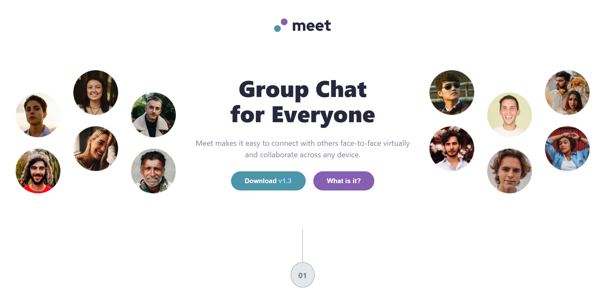
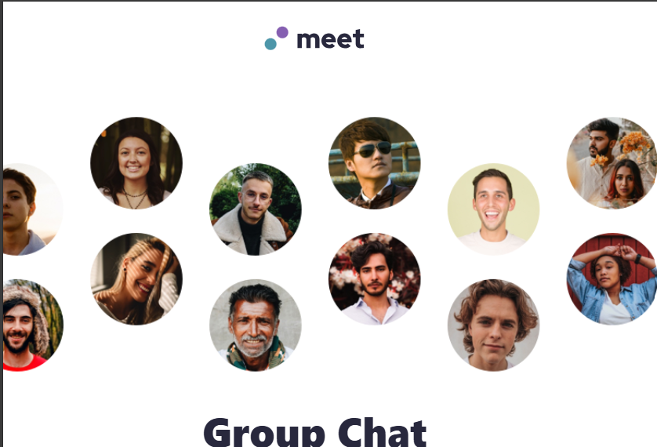
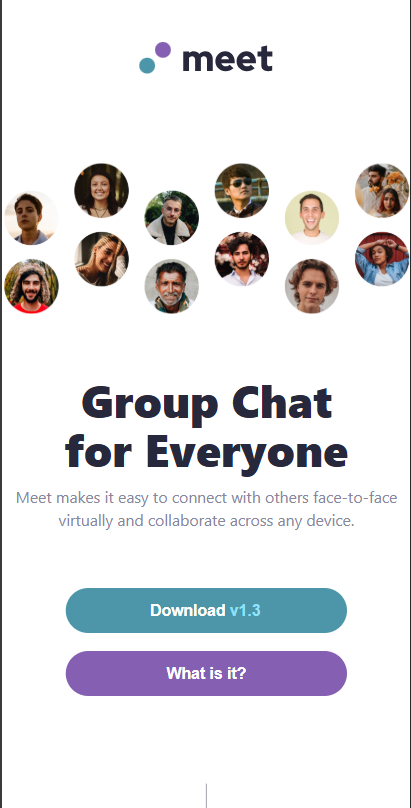

# Frontend Mentor - Meet Landing Page

A responsive landing page for a video conferencing app, built as a solution to the [Frontend Mentor Meet landing page challenge](https://www.frontendmentor.io/challenges/meet-landing-page-rbTDS6URE).


## Table of Contents

- [Overview](#overview)
  - [The challenge](#the-challenge)
  - [Screenshot](#screenshot)
  - [Links](#links)
- [My process](#my-process)
  - [Built with](#built-with)
  - [What I learned](#what-i-learned)
  - [Continued development](#continued-development)
  - [Useful resources](#useful-resources)
- [Author](#author)

## Overview

### The challenge

Users should be able to:

- View the optimal layout for each section depending on their device's screen size
- See hover states for all interactive elements throughout the page
- Use the sample data provided in the design to flesh out the content

### Screenshots

**Desktop**



**Tablet**



**Mobile**



### Links

- [Live Demo](https://meet-landing-page.vercel.app)
- [Solution on Frontend Mentor](https://www.frontendmentor.io/solutions/meet-landing-page)

## My process

### Built with

- Semantic HTML5 markup
- CSS custom properties
- Flexbox
- Media queries for responsive design

### What I learned

This project helped me practice responsive design across three breakpoints (desktop, tablet, and mobile). Key takeaways:

- **Responsive images**: Used different image sources for different screen sizes using CSS `display` properties and media queries
- **Flexbox layouts**: Built the header and footer sections using Flexbox for alignment and spacing
- **Mobile-first adjustments**: Implemented media queries at 768px and 375px to adapt the layout for smaller screens
- **Background images**: Used CSS background properties with overlays for the footer section

```css
/* Example of responsive hero image swap */
.hero-image {
  display: none;
}

@media (max-width: 768px) {
  .hero-image {
    display: block;
  }
  .image {
    display: none;
  }
}
```

### Continued development

Areas I want to continue focusing on:

- CSS Grid for more complex layouts
- CSS animations and transitions
- Accessibility improvements (ARIA labels, keyboard navigation)

### Useful resources

- [MDN Web Docs - CSS Flexbox](https://developer.mozilla.org/en-US/docs/Web/CSS/CSS_flexible_box_layout) - Comprehensive guide to Flexbox
- [CSS Tricks - A Complete Guide to Flexbox](https://css-tricks.com/snippets/css/a-guide-to-flexbox/) - Visual reference for Flexbox properties

## Author

- Frontend Mentor - [https://www.frontendmentor.io/profile/Samm24TT](https://www.frontendmentor.io/profile/yourusername)
- GitHub - [https://github.com/Samm24TT](https://github.com/yourusername)
